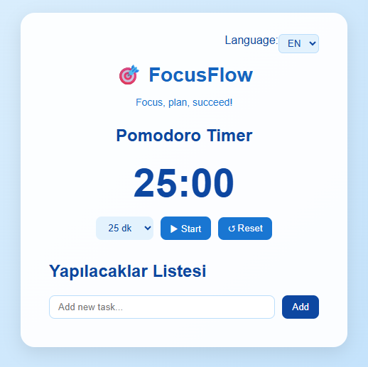
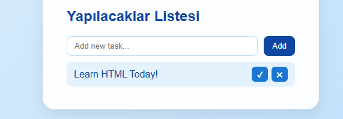

# 🎯 FocusFlow - Pomodoro & To-Do Web Application

FocusFlow is a modern, responsive, and user-friendly web application that combines the Pomodoro technique with a task management (To-Do) system. Designed for productivity enthusiasts, students, and professionals, FocusFlow helps you stay focused, plan your tasks efficiently, and track your progress.

---

## 🌟 Features

- **Pomodoro Timer** ⏳  
  - Default timer 25 minutes (configurable)  
  - Start, pause, and reset functionality  
  - Alert message when time is up  

- **Task Management (To-Do List)** ✅  
  - Add, complete, and delete tasks  
  - Tasks persist in `localStorage`  
  - Clean and interactive UI  

- **Language Selection (EN/TR)** 🌐  
  - Switch between English and Turkish dynamically 

- **Custom Pomodoro Durations** ⏱  
  - User can select work durations (10, 15, 20, 25, 30 minutes)  

- **Responsive Design** 📱  
  - Mobile-friendly layout  
  - Modern blue-white theme with smooth animations  

---

## 🖼 Screenshots

**Pomodoro & Task View:**  
  

**To-Do List:**  
  

**Language Selection:**  
  

---

## 💻 Technologies Used

- **HTML5** – Semantic markup  
- **CSS3** – Modern styling with gradients and flexbox  
- **JavaScript (Vanilla JS)** – Dynamic timer, task management, language switch, localStorage  
- **LocalStorage** – Persistent task storage  
- **Google Fonts** – Poppins for a clean modern font  

---

## 🗂 Project Structure

focus-flow/
│
├── index.html # Main HTML page
├── style.css # Styling
├── script.js # JavaScript logic
└── README.md # Project documentation

---

## 🤝 Contributing

Contributions are welcome! Fork, create a branch, make changes, and submit a Pull Request.

---

## 📝 License

This project is licensed under the MIT License.  

---

## 💡 Future Improvements

- Dark mode toggle  
- Multiple task lists or categories  
- Timer statistics and history  
- Export/Import tasks as JSON  
